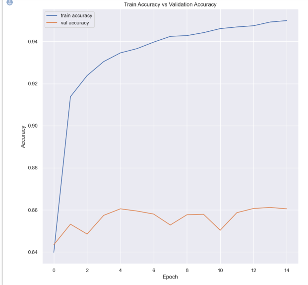
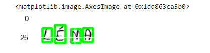
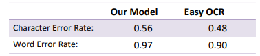

# English-Handwritten-Text-Recognition-and--OCR-
## Introduction
In this project a flexible convolutional neural network is proposed for text recognition. seeks to improve handwritten text prediction using the Neural network on the OCR dataset and the EasyOCR library to extract the whole text from the handwritten text image, then compare it to our model to see if we can outperform the existing EasyOCR model
Our simple model simulates the GRU decoder in EasyOCR is pre-trained model depending on two importantthings:

• Direction of English language ‘left to right’ • Region Of Interest ‘ROI’ by getting the effective region of the image by calculating the change in color between white and black and focusing on black regions because it’s our target in the images. After getting the important regions of the image we use our model to predict each character and combine them tocreate an English word.
## Models
• Handwritten Character Recognition Model
• Easy OCR Model
## Results:

